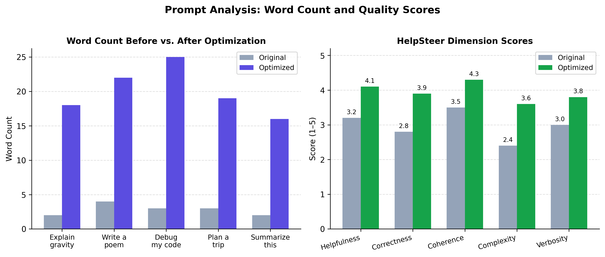
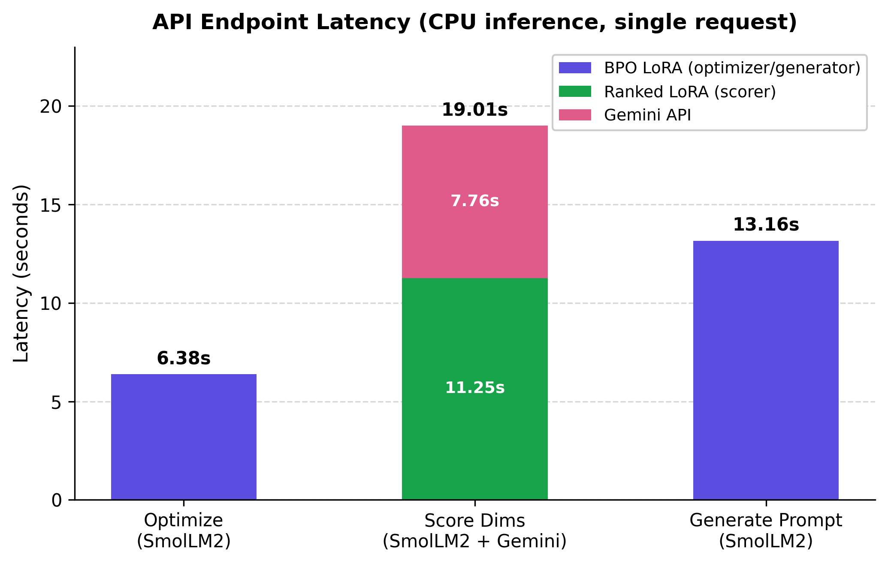
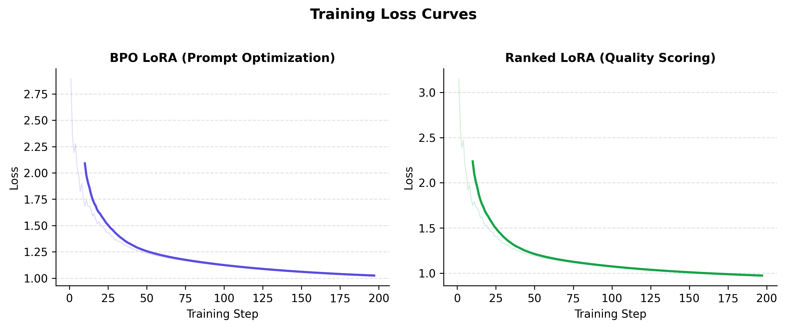

# PromptLab

A React + Vite web app that uses Claude to analyze and improve AI prompts. Built for CS 568 (UIUC).

## Demo

[](https://youtu.be/v9mqQYmustw)

## Features

**Check Prompt mode:** paste a prompt and get scores (0 to 10) for clarity, specificity, tone, and ambiguity, a summary assessment, and a rewritten, optimized version.

**Generate Prompt mode:** describe an idea in plain language and get a ready to use prompt, with an explanation of what was improved.

Recent history lets you click any past entry to restore it.

## Tech Stack

React 18 + Vite, Anthropic Claude API (called directly from the browser), no component library.

## Figures





## Quickstart

```bash
npm install
npm run dev
```

Then open http://localhost:5173
